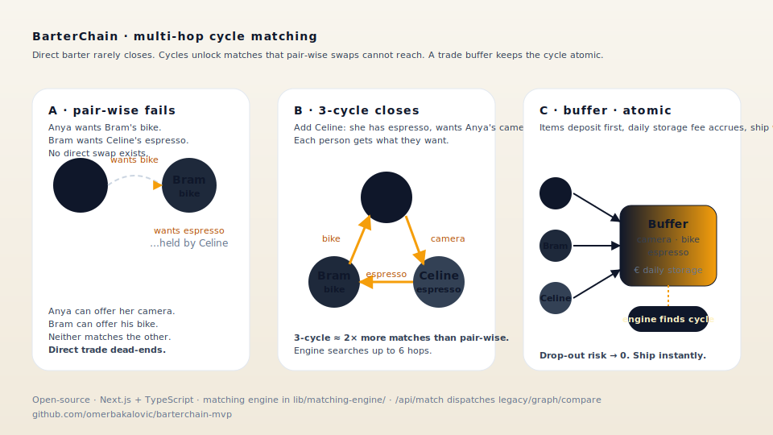

# BarterChain MVP

[](https://barterchain-mvp.vercel.app)

[](https://github.com/omerbakalovic/barterchain-mvp)

> Give what you do not use. Get what you actually want.

BarterChain is an experimental platform for building multi-hop barter loops.
Instead of waiting for one perfect direct swap, the product aims to connect several
people into a single trade chain where each person receives something useful.



> **Read the project pitch:** the architecture, candidate verticals, and an open
> invitation to fork live at [`/pitch`](https://barterchain-mvp.vercel.app/pitch).
> A motion-graphics storyboard is in [`docs/pitch-video-storyboard.md`](docs/pitch-video-storyboard.md).

The current repository contains a Next.js MVP with:

- a product landing page and an investment-pitch page (`/pitch`) with an animated cycle visualization
- a real listing creation flow
- a scored barter-chain search using `have / want`
- a chain proposal and acceptance flow for real trade coordination
- a beta waitlist form
- a trade-buffer module: deposits, releases, daily storage fees, inventory-only matching mode
- Supabase-backed persistence when env vars are present
- local JSON fallback storage for development
- basic PWA metadata through `manifest.ts`
- internal operator dashboards at `/admin/signals` and `/admin/buffer`

## Quick Start

```bash
git clone https://github.com/omerbakalovic/barterchain-mvp.git
cd barterchain-mvp
npm install
npm run dev
```

Open [http://localhost:3000](http://localhost:3000).
If that port is already in use, Next.js will pick the next available one.

## Environment

Create `.env.local` from `.env.example` if you want Supabase persistence:

```bash
SUPABASE_URL=...
SUPABASE_SERVICE_ROLE_KEY=...
MATCH_API_ENGINE=legacy
ADMIN_SIGNALS_ACCESS_KEY=...
# optional — email notifications for chain-invite responses (via resend.com)
RESEND_API_KEY=...
CHAIN_NOTIFY_EMAIL=operator@example.com
CHAIN_EMAIL_FROM="BarterChain <onboarding@resend.dev>"
```

`RESEND_API_KEY` enables email notifications when someone responds on a
`/chain/[id]` page: the operator (`CHAIN_NOTIFY_EMAIL`) is notified on every
response, and participants who accepted with an email-shaped contact are
notified about later responses — most importantly the "everyone accepted,
contacts are now visible" moment. Without the key, notifications are a silent
no-op and everything else works unchanged.

For deploying to Vercel with working waitlist + listing forms, follow the
step-by-step guide in [`docs/supabase-setup.md`](docs/supabase-setup.md).

Expected tables:

```sql
create table waitlist_entries (
  id bigint generated always as identity primary key,
  email text not null,
  use_case text not null default '',
  created_at timestamptz not null
);

create table listings (
  id text primary key,
  title text not null,
  description text not null,
  category text not null,
  value_estimate numeric not null,
  city text not null,
  trust_score numeric not null,
  gives text not null,
  wants text[] not null,
  owner_name text,
  owner_contact text,
  created_at timestamptz not null
);

create table chain_proposals (
  id text primary key,
  chain_id text not null,
  chain_summary text not null,
  chain_score numeric not null,
  participating_listings text[] not null,
  participants jsonb not null,
  status text not null,
  created_at timestamptz not null,
  updated_at timestamptz not null
);

create table match_requests (
  id bigint generated always as identity primary key,
  have text not null,
  want text not null,
  max_hops integer not null,
  engine text not null,
  created_at timestamptz not null
);

create table chain_invites (
  id text primary key,
  title text not null,
  note text,
  participants jsonb not null,
  created_at timestamptz not null,
  updated_at timestamptz not null
);
```

Without Supabase env vars, waitlist entries are stored in `data/waitlist.json` and listings are stored in `data/listings.json`.
`MATCH_API_ENGINE` is optional and keeps `/api/match` on the legacy matcher unless you set it to `graph`.
The internal dashboard reads waitlist data plus logged match requests from `data/match-requests.json`.
In local development, `/admin/signals` is open. In production, access it with `/admin/signals?key=...`
after setting `ADMIN_SIGNALS_ACCESS_KEY`.

## Commands

```bash
npm run dev
npm run lint
npm run build
npm run test
```

## Current MVP Notes

- `app/page.tsx` contains the landing experience, listing form, and chain lab.
- `app/api/listings/route.ts` validates and stores barter listings.
- `app/api/listings/[id]/deposit/route.ts` and `.../release/route.ts` drive the trade-buffer lifecycle for stored listings.
- `app/api/match/route.ts` exposes ranked barter chains and includes stored listings when available; pass `?inventoryOnly=true` to match only against listings currently held in the buffer.
- `app/api/chain-proposals/route.ts` stores chain proposals and blocks overlapping active listings.
- `app/api/waitlist/route.ts` validates and stores waitlist submissions.
- `app/admin/signals` and `app/admin/buffer` provide read-only operator dashboards (gated by `ADMIN_SIGNALS_ACCESS_KEY` in production).
- `app/admin/chains` lets the operator turn a manually found chain into a shareable German-language page at `/chain/[id]`, where participants confirm with one click; contacts unlock only when everyone accepted (concierge-brokering tool born from the Kleinanzeigen field test).
- `lib/listing-store.ts` handles Supabase or local listing persistence.
- `lib/buffer.ts` defines the buffer state machine, size-class pricing, and fee calculation (see [docs/buffer-model.md](docs/buffer-model.md)).
- `lib/chain-proposal-store.ts` persists proposal lifecycle state separately from matching.
- `lib/match-request-store.ts` logs match exploration requests locally for signal analysis.

## License

MIT


